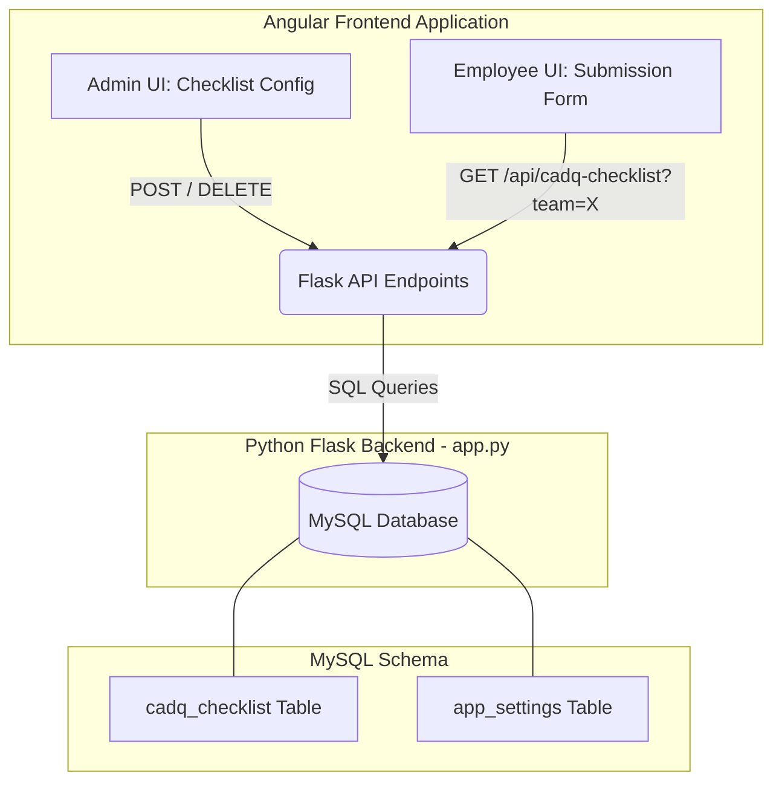

# Complete Architectural & Implementation Guide: Dynamic CADQ Checklist System

This document provides a comprehensive, deep, yet simple and beginner-friendly explanation of everything we built to transform the DrawLogAI CADQ checklist from a static, hardcoded HTML table into a **dynamic, team-specific, real-time database-driven system**.

---

## 1. High-Level Overview: What Did We Build & Why?

### The Problem (Before)
Previously, the CADQ checklist on the Employee Submission page was completely **hardcoded** inside the Angular HTML template (`submission.component.html`). 
- If Atlas Copco added a new drawing standard, modified a sequence number, or changed a validation criteria (like making "Piping" mandatory instead of optional), a developer had to modify the source code, rebuild the Angular app, and redeploy the entire application.
- All employees and teams across the organization were forced to see the exact same static checklist, regardless of whether they worked on Mechanical, Electrical, or Piping designs.

### The Solution (Now)
We built a end-to-end **Dynamic CADQ Checklist Management System**:
1. **Database Storage**: Checklist criteria are stored permanently in a dedicated MySQL database table.
2. **Admin Configuration UI**: Administrators can log into a new UI dashboard ("Checklist Config") to add, edit, delete, and customize checklist points on the fly.
3. **Team-Specific Customization**: Admins can configure a **Global** default checklist for the whole company, OR create custom checklists tailored to specific **Teams** (e.g., Mechanical vs. Electrical).
4. **Real-Time Employee Display**: When an employee opens the submission form, the app dynamically queries the database for their specific team's checklist. Changes made by the admin appear **instantly** without redeploying code!

---

## 2. System Architecture Diagram



---

## 3. Step-by-Step Deep Dive into What Was Built

### Phase 1: Database Schema & Migration (`MySQL`)
We designed and created a flexible MySQL table named `cadq_checklist` to hold all 16 attributes of a checklist item.

#### The Table Schema (`cadq_checklist`)
| Column Name | Data Type | Purpose & Description |
| :--- | :--- | :--- |
| `id` | `INT (AUTO_INCREMENT)` | Unique primary key identifying each checklist row. |
| `seq_nr` | `VARCHAR(20)` | The sequence or rule number (e.g., `1.0`, `4a`, `12.0`). |
| `standard_ref` | `TEXT` | The full drawing standard description (e.g., *1254 K Criteria for surface roughness*). |
| `part_val` | `VARCHAR(10)` | Validation criteria for standard parts (`M` = Mandatory, `O` = Optional, empty = N/A). |
| `piping_val` ... `safety_labels_val` | `VARCHAR(10)` | 12 additional columns covering all design domains (Welded, Ferro, Non-Ferro, Casted, Machined, Sheet Metal, Foam/Decals, Assembly, Instruction, Information, Safety Labels). |
| `team_name` | `VARCHAR(100)` | Stores the specific team name (e.g., `Mechanical`). If set to `NULL`, the row belongs to the **Global** default checklist. |
| `display_order` | `INT` | Controls the sorting order on the screen so rows appear sequentially. |
| `created_at` | `TIMESTAMP` | Automatically timestamps when the row was created. |

> [!IMPORTANT]
> We also updated your master database backup script (`DrawLogAI-DB.sql`) so that whenever you deploy this application to a new server or staging environment, the table is generated automatically!

---

### Phase 2: Backend API Endpoints (`Python Flask - app.py`)
We added three REST API endpoints in `app.py` to act as the bridge between the MySQL database and the Angular frontend.

#### 1. Fetching Checklists (`GET /api/cadq-checklist`)
This endpoint retrieves checklist items for display. It features an **Intelligent Fallback Mechanism**:
- When an employee from team `Mechanical` requests their checklist, the backend first runs:
  ```sql
  SELECT * FROM cadq_checklist WHERE team_name = 'Mechanical' ORDER BY display_order ASC;
  ```
- **If rows are found (e.g., 5 custom items):** It returns *only* those 5 items to the employee.
- **If no rows are found:** The backend automatically falls back to fetching the **Global** default template:
  ```sql
  SELECT * FROM cadq_checklist WHERE team_name IS NULL ORDER BY display_order ASC;
  ```

#### 2. Saving & Updating Items (`POST /api/cadq-checklist`)
This endpoint receives JSON data from the Admin UI:
- If an `id` is provided, it executes an `UPDATE` query to modify the existing row.
- If no `id` is present, it executes an `INSERT INTO` query to create a brand new row.
- It automatically converts empty strings or `"Global"` team selections into SQL `NULL` values.

#### 3. Deleting Items (`DELETE /api/cadq-checklist/<id>`)
Permanently deletes a specific row from the `cadq_checklist` table by its unique `id`.

---

### Phase 3: The Admin Configuration UI (`CadqConfigComponent`)
We created a brand new, beautifully styled Angular component (`/src/app/cadq-config/`) where administrators can manage everything without touching code.

#### Key Features Built into the Admin UI:
1. **Team Selector Dropdown**: 
   - Dynamically loads all existing organizational teams from your backend (`/api/structure/teams`).
   - Admins can select **"Global"** to edit the company-wide default checklist, or pick a specific team to build a custom override list.
2. **Built-in 26 Primary Standard Template**:
   - We extracted all 26 original Atlas Copco drawing standard rules (from sequence `1.0` to `75`) and embedded them directly into the TypeScript code (`PRIMARY_CHECKLIST`).
   - Whenever an admin selects a team that has an empty database, the UI **automatically loads these 26 points** onto the screen as a ready-to-use template!
3. **Interactive Grid Controls**:
   - **`+ Add Row` Button**: Appends a blank row at the bottom of the grid for custom rules.
   - **`Load Default Checklist` Button**: Instantly resets the screen back to the 26 standard Atlas Copco rules.
   - **`Save All New` Button**: A powerful batch-save tool. Instead of clicking save 26 times, clicking this button iterates through all new unsaved rows and commits them to the database in seconds.
   - **Row-level Actions**: Individual `Save` (disk icon) and `Delete` (trash icon) buttons on every row with safety warning popups via SweetAlert.
4. **Atlas Copco Premium Branding**:
   - Designed with deep teal headers (`#054E5A`), clean card layouts, sticky table headers for easy scrolling over large lists, and subtle hover animations.

---

### Phase 4: Employee Submission Integration (`SubmissionComponent`)
Finally, we connected the live database to the employee submission workflow.

1. **Removed Static Code**: We stripped out the hundreds of lines of hardcoded HTML table rows in `submission.component.html` and replaced them with a dynamic Angular `@for` loop over `checklistItems`.
2. **Dynamic Team Linking**: When an employee logs in or selects their Creator ID, the frontend reads their assigned team (`emp_team`) and calls:
   ```ts
   this.http.get(`${this.API}/api/cadq-checklist?team=${encodeURIComponent(team)}`)
   ```
3. **Real-Time Synchronization**: The employee sees the exact checklist configured by the admin. If the admin adds a 6th point or changes a standard reference, the employee sees it the very next time they open or refresh the page!

---

## 4. Summary of How to Use the System (User Workflow)

### Workflow A: Customizing a Team's Checklist (e.g., leaving only 5 items)
1. Go to the **Checklist Config** page in the application.
2. Select your target team from the dropdown (or select "Global").
3. If the database is empty, the **26 default items** will automatically populate the screen.
4. Click the **Delete** (trash icon) on any 21 rows you do not need. Because they are not yet saved to the database, they will vanish from the screen instantly.
5. Once only your desired **5 items** remain, click **"Save All New"**.
6. The database now stores exactly those 5 items for that team. When an employee of that team logs in, they will see **only those 5 items**!

### Workflow B: Adding a Brand New Custom Rule
1. In **Checklist Config**, select the target team.
2. Click **`+ Add Row`** at the top left of the grid.
3. Scroll to the bottom and enter your Sequence Number (e.g., `99.0`) and Standard Reference (e.g., `Check new safety valve dimensions`).
4. Select `M` (Mandatory) or `O` (Optional) from the dropdowns for the relevant domains.
5. Click the green **Save** button on that row (or click **Save All New**). It is instantly live!

---

## 5. Verification & Testing History
During our session, we ran comprehensive verification scripts to ensure stability:
- **Concurrency & POST Testing**: Verified that batch saving multiple items does not lock or crash the MySQL database.
- **URL Routing Verification**: Discovered and resolved an Angular routing typo where `/api/` prefix was omitted, ensuring seamless communication with the Nginx/Flask reverse proxy.
- **Database Hygiene**: Created and executed cleanup scripts (`wipe.py`, `cleanup.py`) to purge temporary test data and duplicate rows, leaving your database 100% clean and production-ready.
