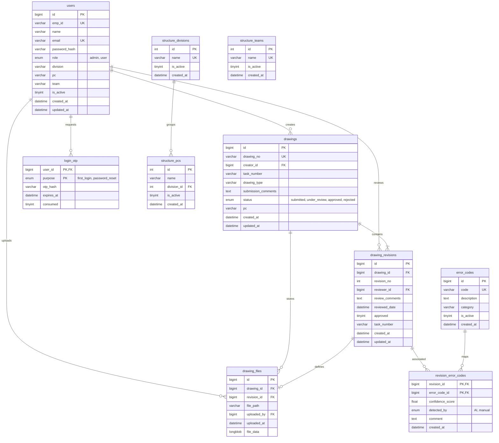

# Atlas Copco DrawLogAI: Phase 2 - High Level Architecture

This document outlines the detailed system architecture, component structures, database schema relationships, deployment environments, and request flows of the **Atlas Copco DrawLogAI** platform.

---

## 1. Complete System Architecture

The following diagram illustrates the complete system architecture, showcasing the client tier, the web/reverse-proxy tier, the application server, and the external integrations (Database, ML model, SMTP mail server).

```mermaid
graph TB
    subgraph Client Tier (Browser)
        User[Creator / Reviewer / HR]
        SPA[Angular SPA Application]
        PDFJS[PDF.js Viewer Engine]
        User --> SPA
        SPA --> PDFJS
    end

    subgraph Web & Proxy Tier (IIS Server)
        IIS[IIS Web Server]
        Static[Static File Handler]
        Rewrite[URL Rewrite Module]
        ARR[Application Request Routing]
        
        SPA -->|HTTP/HTTPS| IIS
        IIS --> Static
        IIS --> Rewrite
        Rewrite -->|Proxy API Requests /api/| ARR
    end

    subgraph Application Tier (Flask Service)
        Waitress[Waitress WSGI Server<br/>Port 5000]
        Flask[Flask Application]
        PyMuPDF[PyMuPDF / fitz Engine]
        ML[AI/ML Engine<br/>TF-IDF + Classifier]
        
        ARR -->|Localhost Reverse Proxy| Waitress
        Waitress --> Flask
        Flask --> PyMuPDF
        Flask --> ML
    end

    subgraph External & Storage Services
        MySQL[(MySQL Database<br/>atlascopco_drawing_db)]
        SMTP[SMTP Mail Server]
        FS[Disk Storage<br/>uploads/annotations/]
        
        Flask -->|PyMySQL Driver| MySQL
        Flask -->|SMTP Port 25/587| SMTP
        Flask -->|File Write| FS
    end
```

---

## 2. Frontend Architecture (Angular)

The frontend is built using **Angular (v16.1.4)** and runs as a single-page application (SPA). Its architecture is designed around componentization, state-less components, services for business logic/auth, and HTTP interceptors.

```mermaid
graph TD
    subgraph UI Components
        Login[AdminLoginComponent]
        Submission[SubmissionComponent]
        Uploads[UploadsComponent]
        Canvas[CanvasComponent]
        Reports[ReportsComponent]
        Structure[StructureComponent]
        Employee[EmployeeComponent]
    end

    subgraph Core Services & Routing
        Routing[AppRoutingModule]
        AuthGuard[AuthGuard]
        AuthService[AuthService]
        HTTPClient[Angular HttpClient]
        Interceptor[AuthInterceptor]
    end

    subgraph External Libraries
        PDFjs["pdfjs-dist (PDF.js Worker)"]
        Swal[SweetAlert2 UI Popups]
    end

    Routing -->|Route Security| AuthGuard
    AuthGuard -->|Uses| AuthService
    UI Components -->|Navigate| Routing
    UI Components -->|Inject| AuthService
    UI Components -->|Inject| HTTPClient
    HTTPClient -->|Interrupted by| Interceptor
    Interceptor -->|Append JWT / Auth headers| HTTPClient
    
    Canvas -->|Uses Client-side Rendering| PDFjs
    Submission -->|Uses Alerts| Swal
    Uploads -->|Uses Alerts| Swal
```

* **[AppRoutingModule](file:///c:/Atlas-Copco-DrawLogAI/frontend/src/app/app-routing.module.ts):** Maps paths to components and configures `AuthGuard` roles (`HR` or `Employee`).
* **[AuthService](file:///c:/Atlas-Copco-DrawLogAI/frontend/src/app/auth.service.ts):** Stores session info, logged-in user names, and access roles (`HR` / `Employee`) in LocalStorage.
* **[AuthInterceptor](file:///c:/Atlas-Copco-DrawLogAI/frontend/src/app/auth.interceptor.ts):** Automatically adds authentication tokens to outgoing requests.
* **[CanvasComponent](file:///c:/Atlas-Copco-DrawLogAI/frontend/src/app/canvas/canvas.component.ts):** Leverages `pdf.js` worker to load PDFs and draw dynamic annotations (shapes, text, pen paths) on top of HTML5 `<canvas>`.

---

## 3. Backend Architecture (Flask)

The backend is built in **Flask (Python 3.8+)** and is hosted as a WSGI application using **Waitress** for thread safety and high concurrency.

```mermaid
graph LR
    subgraph API Route Layer
        AuthR[Auth Routes<br/>/admin-login, /auth/*]
        UploadR[Upload Routes<br/>/upload, /submit-batch]
        AuditR[Audit Routes<br/>/submit, /prefill-upload]
        ReportR[Report Routes<br/>/api/*-report]
        CanvasR[Canvas Routes<br/>/annotations/*, /drawings/*]
        StructureR[Structure Routes<br/>/api/structure/*]
    end

    subgraph Middlewares & Hooks
        BeforeReq["before_request Hook<br/>(Initialize g.db via connect_to_db)"]
        TeardownReq["teardown_request Hook<br/>(Close g.db)"]
    end

    subgraph Engine Layer
        PyMySQL[PyMySQL Driver]
        PyMuPDF[PyMuPDF / fitz]
        MLClassifier[Joblib Model Inference]
        SMTPLib[SMTP client]
    end

    BeforeReq --> API Route Layer
    API Route Layer --> TeardownReq
    
    API Route Layer -->|SQL Transactions| PyMySQL
    API Route Layer -->|PDF Extraction & Annotation| PyMuPDF
    API Route Layer -->|Inference on Comments| MLClassifier
    API Route Layer -->|Alert Dispatch| SMTPLib
```

* **Request Lifecycle Context:** Connections are managed cleanly. Flask `before_request` initiates a MySQL connection, registers it in Flask global object `g.db`, and `teardown_request` safely closes the connection at the end of the request loop.
* **AI Engine:** Exposes `/upload` endpoint. Loads a TF-IDF vectorizer and a classifier model via `joblib` to predict standard error codes from text strings.
* **PDF Engine:** PyMuPDF (`fitz`) handles extraction of comments and drawing stamp frames and shapes (Check/Cross marks) on output bytes.

---

## 4. Database Architecture (MySQL)

The database schema `atlascopco_drawing_db` is normalized to support parent drawings, revision tracking, physical files, organizational units, and error codes without data redundancy.



---

## 5. Deployment & Infrastructure Architecture

The application is deployed on a **Windows Server Environment** hosting the entire technology stack.

```mermaid
graph TD
    Client[Client Device]
    DNS[Domain DNS Resolver]
    FW[Windows Firewall]
    
    subgraph Windows Server (IP: 10.91.17.78)
        subgraph IIS (Proxy Server)
            IISPort80[HTTP Port 80]
            IISPort443[HTTPS Port 443]
            ARRProxy[ARR Proxy Cache]
            WebConfig[web.config Redirects]
            StaticFiles[Angular Dist Package<br/>C:/inetpub/atlascopco-app/frontend/]
        end

        subgraph Python Background Service (Waitress)
            WaitressSvc[Waitress Service WSGI<br/>127.0.0.1:5000]
            BackendApp[Flask backend app<br/>C:/inetpub/atlascopco-app/backend/]
        end

        subgraph Database Server
            MySQLDB[MySQL Daemon<br/>Port 3306]
        end
    end
    
    subgraph Enterprise Infrastructure
        MailServer[SMTP Mail Server<br/>Port 25/587]
    end

    Client -->|DNS Lookup drawlogai.atlascopco.group| DNS
    Client -->|HTTPS Request| FW
    FW --> IISPort443
    IISPort80 -->|Permanent Redirect| IISPort443
    
    IISPort443 --> WebConfig
    WebConfig -->|Angular Routes| StaticFiles
    WebConfig -->|Proxy /api/*| ARRProxy
    ARRProxy -->|Local TCP Loopback| WaitressSvc
    
    WaitressSvc --> BackendApp
    BackendApp -->|Local DB connection| MySQLDB
    BackendApp -->|Send Mail| MailServer
```

* **IIS Server:** Serves compiled Angular assets directly for speed. Proxies `/api` to Waitress via ARR URL Rewrite rules. 
* **Windows Service:** Spawns waitress server using `pywin32` scripts to run persistently in the background.
* **Firewall Rules:** Inbound rules allow TCP traffic on port 80 (redirected) and port 443 (SSL secured).
* **web.config:** Critical file in the frontend folder that routes browser history requests to index.html and routes API calls to the Waitress port.

---

## 6. User Request Flow: Detailed Traversal

To understand how data travels from a user action to the database storage and response, let’s trace the request flow of a **Reviewer submitting a Drawing review**:

```mermaid
flowchart TD
    A[Reviewer clicks 'Submit Review' on UI] --> B[Angular HTTP client triggers POST to /api/submit]
    B --> C[Request passes AuthInterceptor, appending authentication headers]
    C --> D[Request arrives at IIS Server via HTTPS on Port 443]
    D --> E[IIS URL Rewrite intercepts /api/ prefix]
    E --> F[ARR Module proxies request to http://127.0.0.1:5000/api/submit]
    F --> G[Waitress WSGI processes socket, queues thread, and spawns Flask context]
    G --> H[Flask before_request hook triggers: connect_to_db returns connection object]
    H --> I[Flask assigns connection to global variable g.db]
    I --> J[Request routes to submit_data function inside app.py]
    J --> K[Payload parses: base64 PDF bytes decoded; metadata verified]
    K --> L[g.db.cursor starts transaction]
    L --> M[Upsert SQL on drawings & drawing_revisions tables executed]
    M --> N[SQL executed to write PDF bytes into drawing_files table]
    N --> O[Old error codes purged; new records written in revision_error_codes]
    O --> P[Transaction commit g.db.commit executed]
    P --> Q[SMTP connector triggers send_email in background]
    Q --> R[Flask before_request context closes: teardown_request triggers db.close]
    R --> S[Waitress sends JSON payload response back to IIS Proxy]
    S --> T[IIS sends HTTPS response back to client browser]
    T --> U[Angular updates view state: SweetAlert notification pops up]
```



### Flow Step Explanations:

1. **Client Trigger:** The reviewer fills out details in the Uploads UI and clicks "Submit". 
2. **Frontend Routing:** Angular's [AuthInterceptor](file:///c:/Atlas-Copco-DrawLogAI/frontend/src/app/auth.interceptor.ts) intercepts the outgoing HTTP call, injects authentication headers from LocalStorage, and dispatches the payload to the server.
3. **Web Server Interception:** The request reaches the Windows Server firewall and is processed by IIS. IIS's URL Rewrite identifies the `/api/` pattern and forwards it to Waitress.
4. **App Server Connection Setup:** Waitress receives the request. Flask's `@app.before_request` hook executes, creating a connection to MySQL via `pymysql.connect()` and storing it in `g.db` for thread safety.
5. **Business Logic Execution:** The payload is processed by `submit_data()`:
   * Normalizes fields (e.g. pads revision integers, prefixes `DR_` to drawing IDs).
   * Decodes drawing PDF files from Base64.
   * Runs queries to upsert `drawings` and `drawing_revisions`.
   * Inserts the PDF binary content as `LONGBLOB` into `drawing_files`.
   * Clears old errors for this revision, links new errors inside `revision_error_codes`, and updates status (approved/rejected).
6. **Transaction Commitment:** If all database queries succeed without exception, `g.db.commit()` is called. If any query fails, the `try-except` block runs `g.db.rollback()` to prevent database corruption.
7. **Side Effects (SMTP):** Backend connects to SMTP, generates a MIME message, attaches the PDF, and sends an email to the creator.
8. **Resource Teardown:** Flask's `@app.teardown_request` runs, guaranteeing `db.close()` is called on the request's connection.
9. **Client Update:** The frontend receives the JSON response (e.g., `{"ok": true}`), displays a success popup via SweetAlert, and resets the form.
