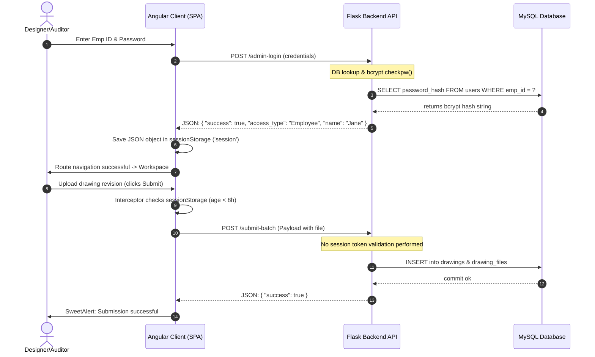
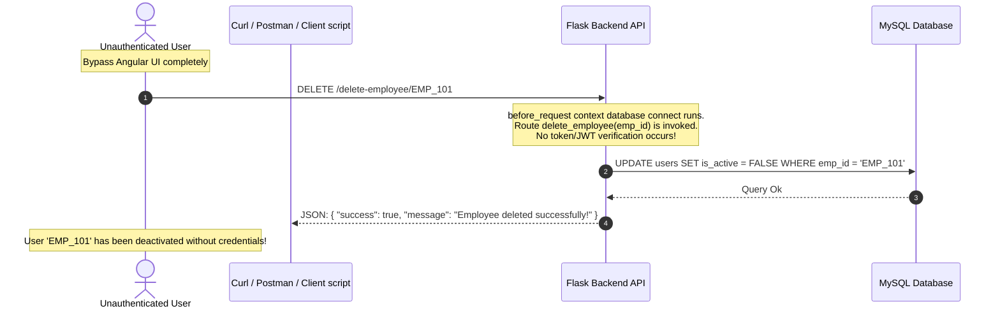
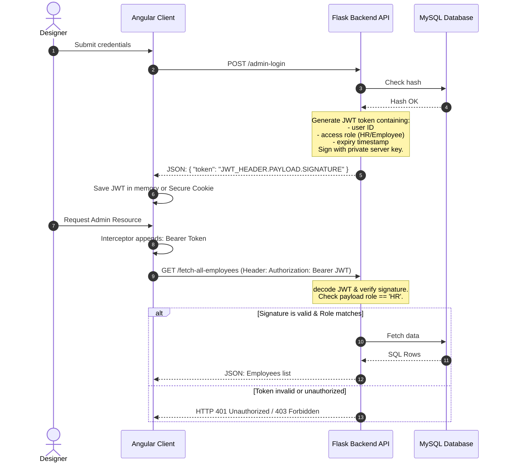

# Atlas Copco DrawLogAI: Phase 7 - Authentication & Security Deep Analysis

This document provides a security audit and analysis of the authentication mechanism, role enforcement, and session states of **Atlas Copco DrawLogAI**. 

> [!WARNING]
> This analysis highlights a **critical security vulnerability** in the application's current design regarding the lack of backend authentication.

---

## 1. Authentication & Session Flow Analysis

### A. Current Login Flow
1. **User Request:** The client inputs their Employee ID and Password at the `/admin-login` page.
2. **API Dispatch:** The Angular client sends a `POST` request to the backend `/admin-login` endpoint.
3. **Hash Matching:** The Flask server checks if the employee ID exists in the `users` table and is active. It matches the password against `users.password_hash` using `bcrypt.checkpw()`.
4. **Role Mapping:** If credentials are valid, the server translates database roles:
   * Database `admin` -> Mapped to UI access type `HR`
   * Database `user` -> Mapped to UI access type `Employee`
5. **Local Storage:** The Flask server sends a `200 OK` JSON response. The client-side [AuthService](file:///c:/Atlas-Copco-DrawLogAI/frontend/src/app/auth.service.ts) caches this state as a JSON string inside browser `sessionStorage` under the key `session`.

### B. Session Handling
* **Storage Location:** Browser `sessionStorage` (cleared automatically when the browser tab is closed).
* **Expiration Cap:** The frontend enforces a client-side hard limit session age of **8 hours** (`SESSION_MAX_AGE_MS = 8 * 60 * 60 * 1000`).
* **Request Interception:** The [AuthInterceptor](file:///c:/Atlas-Copco-DrawLogAI/frontend/src/app/auth.interceptor.ts) runs on every outbound HTTP request (except `/admin-login`). It evaluates local session age. If expired, it triggers `authService.logout()` and cancels the request.

---

## 2. JWT, Cookie, & Token Implementations

* **Analysis:** **There is currently NO JWT, Cookie, or secure Token implementation in the codebase.**
* **API Authentication Status:** The Flask backend endpoints do **not** check for JWT tokens, session cookies, or verification headers. Requests made to endpoints like `/fetch-all-employees` or `/submit` are processed stateless without verifying credentials.

---

## 3. User Roles & Permission System

The system defines two main access roles, checked solely on the client side:

1. **HR (Admin):**
   * **Intended Permissions:** Manage organizational divisions/PCs/teams, create accounts, edit accounts, soft-delete employees, and review analytics dashboards.
   * **UI Guard:** Protected in routing via `data: { roles: ['HR'] }`.
2. **Employee (User):**
   * **Intended Permissions:** Upload drawing PDFs in batch, view pending requests queue, load interactive canvas pages, and download drawings.
   * **UI Guard:** Protected in routing via `data: { roles: ['Employee'] }`.

---

## 4. Security Sequence Diagrams

### Diagram 1: Current Application Auth & Request Flow (Successful Audit)

This sequence shows the current standard workflow where the client relies on frontend checks to protect routes.

### Diagram 2: Security Vulnerability (Direct API Exploitation Bypass)

Since the backend API does not validate JWTs or verify session scopes, any client can request backend changes directly.

---

## 5. Security Risks & Vulnerabilities

### 1. Broken Object Level Authorization (BOLA) & Lack of Backend Authentication (Critical)
* **Risk:** All Flask backend endpoints are completely open. Anyone with network access to the API (e.g. `https://drawlogai.atlascopco.group/api/fetch-all-employees`) can download user details, modify organizational structures, upload files, or soft-delete accounts without providing passwords or sessions.
* **Severity:** **CRITICAL**

### 2. Client-Side Authorization Tampering
* **Risk:** The Angular client relies on the `accessType` string inside `sessionStorage` to decide whether to show Admin/HR pages. An attacker can open the browser console, edit the `session` object, change `accessType` to `"HR"`, and immediately bypass route guards to access the admin UI.
* **Severity:** **HIGH**

### 3. Cleartext/Unauthenticated SMTP Relaying
* **Risk:** The SMTP configuration parameters in `app.py` support running without TLS or authentication (port 25 fallback). If the server connects to an unauthenticated open relay server, malicious actors could hijack the server to dispatch spam emails or spoof internal notifications.
* **Severity:** **MEDIUM**

### 4. Cross-Site Scripting (XSS) Session Hijacking
* **Risk:** Because session metadata (names, employee IDs, roles) is stored in standard `sessionStorage`, it is accessible to any script running on the page. If the page is compromised via an XSS injection, an attacker can extract session keys.
* **Severity:** **MEDIUM**

---

## 6. Recommended Best Practices for Remediation

To secure the DrawLogAI application, the following updates are recommended:

### A. Implement Secure JWT Validation Flow

### B. Security Mitigation Tasks:
1. **Server-Side Token Verification:**
   * Integrate a Python JWT library (e.g. `PyJWT`).
   * When logging in, generate a cryptographically signed JWT token containing the user's role and ID.
   * Require an `Authorization: Bearer <Token>` header on all endpoints.
2. **Implement JWT Decryption Middleware:**
   * Add token validation checks to Flask's `@app.before_request` hook, rejecting unauthenticated requests with an HTTP 401 status.
3. **Use HttpOnly Cookies:**
   * Instead of storing session metadata in client-accessible `sessionStorage`, set JWTs in **HttpOnly, Secure, and SameSite** cookies. This blocks access from malicious JavaScript scripts, neutralizing XSS session hijacking.
4. **Bake SMTP Credentials:**
   * Ensure that port 587 is enforced on the production VM, and verify credentials on all outbound SMTP connections using SSL contexts.
