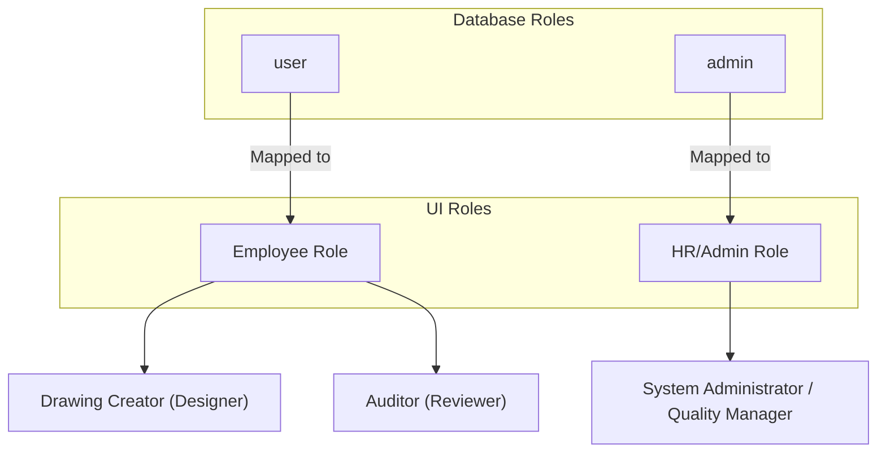
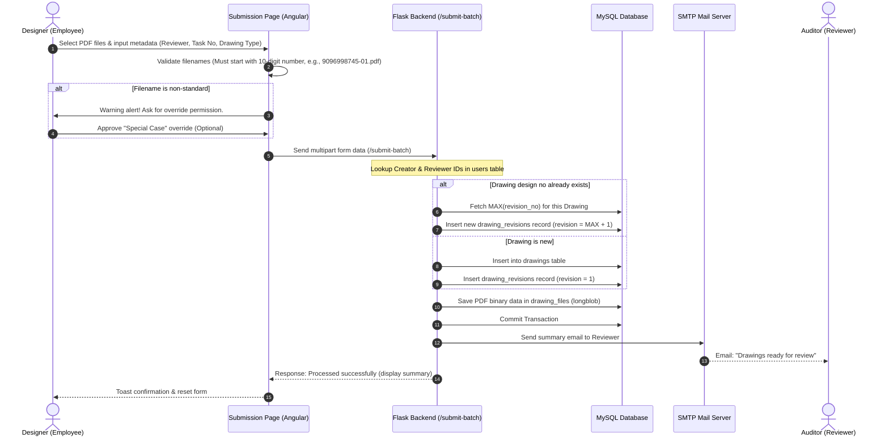
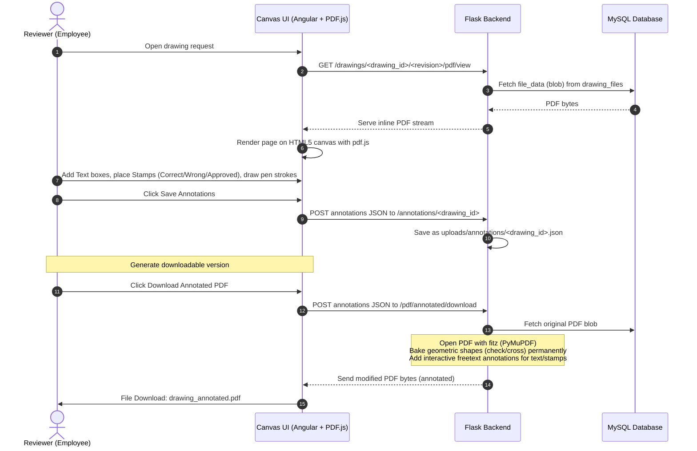

# Atlas Copco DrawLogAI: Phase 1 - Business Understanding

This document provides a detailed reverse-engineered analysis of the business logic, workflow, system modules, and database structure of the **Atlas Copco DrawLogAI** project.

---

## 1. Project Purpose & Objective

**DrawLogAI** is a specialized engineering drawing audit, quality control logging, and review tracking platform. Its core objective is to **digitize, standardize, and automate the drawing review process**. 

Instead of engineers and auditors manually logging errors, copying comments from PDF drawings, and tracking revisions in spreadsheets, DrawLogAI provides a centralized system where:
* Drawings are uploaded, version-controlled, and tracked automatically.
* Review comments (annotations) inside PDFs are parsed programmatically.
* **Artificial Intelligence (NLP/Machine Learning)** extracts and classifies natural language feedback comments into standardized error codes.
* Auditors can draw markups, place stamps, and save interactive reviews on drawings via a web-based canvas interface.
* Management receives analytical quality reports indicating error trends, cycle times, and organizational performance.

---

## 2. The Business Problems Solved

In large manufacturing and engineering companies like Atlas Copco, engineering drawings (designing parts, flexible hoses, decals, metal sheets, casting, etc.) undergo rigorous review cycles to ensure safety and precision. 

DrawLogAI solves several pain points:

* **Manual Feedback Parsing & Data Entry:** Reviewers leave notes inside drawing PDFs. Without this tool, administrators must manually read every comment, copy it, and categorize it in a ledger. DrawLogAI extracts this data programmatically.
* **Lack of Standardized Quality Data:** Reviewers write comments in their own style (e.g., *"missing diameter dimensions"* vs. *"dim for hole not shown"*). DrawLogAI's AI model classifies these different phrases into a single standard error code, enabling structured data analysis.
* **Version Control & Audit Logs:** The system maintains historical revisions of every drawing, allowing engineers to track what changed, when, and who approved/rejected it.
* **Centralized Dashboard for Quality Metrics:** Quality Assurance leads and HR managers can identify which teams or individuals make the most errors and what specific errors are most frequent. This drives targeted training programs.

---

## 3. Users of the System

The system defines three core stakeholder groups, mapped to two web roles (`Employee` and `HR`) derived from two database roles (`user` and `admin` in the `users` table):



### A. Drawing Creator (Designer / Employee)
* **Who they are:** Design engineers who produce the drawings.
* **System Actions:**
  * Log in via the web client.
  * Submit drawing files (PDF) in batches.
  * Track the status of their drawing requests (Pending, Approved, Rejected).
  * Read auditor comments and download annotated drawings to correct them.
  * Reset/change their own passwords using an OTP verification flow.

### B. Auditor (Reviewer / Employee)
* **Who they are:** Senior engineers or quality controllers who audit drawings.
* **System Actions:**
  * Receive email notifications when drawings are submitted.
  * Load drawings into the **Interactive Canvas** page.
  * Review drawings, draw pen lines, write comments, and stamp "Approved", "Reviewed", "Correct", or "Wrong" directly on the canvas.
  * Run the **AI Error Classification tool** to extract PDF comments and suggest error codes.
  * Submit the final audit decision (Approve or Reject), which triggers automated notifications.

### C. System Administrator / HR Manager (HR Role)
* **Who they are:** QA managers, engineering heads, or system administrators.
* **System Actions:**
  * Manage organization structure (Create/Edit/Delete Divisions, Product Companies (PCs), Teams).
  * Add, edit, and soft-delete Employee accounts.
  * Access the **Overview Dashboard** and comprehensive analytics tools to review quality indicators, auditor leaderboards, monthly trends, and error Pareto charts.

---

## 4. Major System Workflows

### Workflow 1: Drawing Submission and Naming Validation



### Workflow 2: AI-Assisted Drawing Audit & Review Submission

```mermaid
sequenceDiagram
    autonumber
    actor Auditor as Reviewer (Employee)
    participant UI as Uploads / Audit UI
    participant API as Flask Backend (/upload & /submit)
    participant DB as MySQL Database
    participant ML as ML Classifier & TF-IDF
    participant Mail as SMTP Mail Server
    actor Creator as Designer

    Auditor->>UI: Select Drawing & Upload annotated PDF
    UI->>API: POST file to /upload
    Note over API: Read PDF using PyMuPDF (fitz)
    API->>API: extract_annotations() -> Get natural text notes
    API->>ML: Send comments to predict_error()
    ML->>ML: Run TF-IDF vectorizer & classifier
    ML-->>API: Return predicted standardized error codes
    API-->>UI: JSON response: comments & predicted error codes
    UI->>Auditor: Show review table (allow editing error codes, comments, and decision)
    Auditor->>UI: Click Submit Review (Decision: Approve / Reject)
    UI->>API: POST payload to /submit (metadata, comments, errors, decision)
    Note over API: Verify Creator/Reviewer; insert/update drawing_revisions
    API->>DB: Delete old errors & Insert new revision_error_codes
    API->>DB: Update drawing status in drawings table (approved / rejected)
    API->>DB: Commit Transaction
    API->>Mail: Send completed audit email with PDF attachment
    Mail-->>Creator: Email: "Drawing Review Notification" (contains PDF, decision, errors)
    API-->>UI: Audit logged successfully
```

### Workflow 3: Interactive Canvas Annotation & Dynamic PDF Baking



---

## 5. Core System Modules

| Module Name | Tier | Primary File / Component Path | Description |
| :--- | :--- | :--- | :--- |
| **Authentication Module** | Backend | `backend/Atlashost/app.py` | Handles `/admin-login`, password policy enforcement, OTP generation (4 digits), SMTP emailing for OTP, and password reset (`/auth/forgot-password/*`). |
| **User & Employee Manager** | Backend | `backend/Atlashost/app.py` | APIs to `/add-employee` (creates credentials with email as default password), `/edit-employee`, `/delete-employee` (implements soft-delete), and `/get-employees`. |
| **Organization Structure** | Backend | `backend/Atlashost/app.py` | Exposes CRUD routes for Divisions, Product Companies (PCs), and Teams (`/api/structure/*`). |
| **Drawing Uploader** | Backend | `backend/Atlashost/app.py` | Handles single uploads (`/upload`) and batch uploads (`/submit-batch`), naming syntax checks, and file storage in the database. |
| **AI ML Inference Engine** | Backend | `backend/Atlashost/app.py`, `tfidf_vectorizer.pkl`, `error_code_classifier_model.pkl` | Performs NLP text extraction from PDF notes via PyMuPDF and runs Scikit-Learn TF-IDF classification to map feedback to error codes. |
| **Interactive Canvas Engine** | Frontend/Backend | `frontend/src/app/canvas/*`, `backend/Atlashost/app.py` | Frontend interface using `pdf.js` for drawing markups and shapes. Backend handles baking these annotations onto drawing streams (`/pdf/annotated/*`). |
| **Reports & Analytics Dashboard** | Frontend/Backend | `frontend/src/app/reports/*`, `backend/Atlashost/app.py` | Aggregates database counts to serve KPI metrics, trend charts, leaderboards, and PDF download handlers. |

---

## 6. System Data Flow (Inputs vs. Outputs)

```
       DATA INPUTS                                      DATA OUTPUTS
  +--------------------+                           +--------------------+
  | - PDF Drawing files|                           | - Standardized     |
  |   (with comments)  |                           |   Error Logs       |
  +--------------------+                           +--------------------+
  | - Drawing Metadata |                           | - Annotated PDFs   |
  |   (Task, Type, PC) |                           |   (Baked shapes)   |
  +--------------------+       +-----------+       +--------------------+
  | - Organization     | ----> | DrawLogAI | ----> | - Alert Emails     |
  |   Entities         |       |  System   |       |   (PDF attachments)|
  +--------------------+       +-----------+       +--------------------+
  | - Employee Account |                           | - Analytical       |
  |   Credentials      |                           |   Charts & KPIs    |
  +--------------------+                           +--------------------+
  | - Canvas Markups   |                           | - OTP & Security   |
  |   (x, y, pen lines)|                           |   Notifiers        |
  +--------------------+                           +--------------------+
```

---

## 7. Critical Business Rules

1. **Drawing Naming Convention:**
   * A standard drawing file must begin with exactly 10 digits representing the drawing ID (e.g. `7058609753`).
   * Optionally, it can contain a revision suffix separated by a hyphen (e.g., `-01`).
   * Files violating this are flagged, requiring explicit operator approval to upload under a "special case" override.
2. **Automated Version Control:**
   * If a drawing ID is loaded for the first time, its database record is created and assigned as **Revision 1**.
   * If a drawing ID already exists, the system automatically increments the revision index (`MAX(revision_no) + 1`).
3. **Database Transaction Consistency:**
   * Multi-query routes utilize Flask request contexts (`before_request`/`teardown_request`) with `pymysql.connect` and `autocommit=False`. Transactions commit only upon full completion, rolling back if file storage, error mappings, or status writes fail.
4. **Soft Account Deletion:**
   * To prevent data corruption in historical audits, employees are never hard-deleted. The `delete-employee` API cleans up active OTP entries and sets `users.is_active = FALSE`.
5. **Secure Authentication Flow:**
   * Passwords are encrypted using `bcrypt` (12 rounds).
   * OTPs are generated as random 4-digit integers, hashed in the database, valid for 5 minutes, and cleared immediately after consumption.
   * Users cannot reuse their existing password when resetting.

---

## 8. Mission Critical Elements

* **PyMuPDF (fitz) & pdf.js Dependencies:** The core function of reading annotations and rendering/baking Canvas shapes depends on these libraries. Any version mismatch or installation issues will break the review flow.
* **Model Serialization (`error_code_classifier_model.pkl` & `tfidf_vectorizer.pkl`):** The AI classification logic loads these serialized objects using `joblib`. If these files are corrupt or deleted, the `/upload` API will throw 500 exceptions, disabling the automated error log generation.
* **Database Connection Stability:** Because PDF files are stored directly as `LONGBLOB` binary fields in the `drawing_files` table, database memory overhead, packet sizes (`max_allowed_packet` in MySQL configuration), and timeouts must be monitored.
* **SMTP Mail Engine Connection:** Completed drawing releases rely on transactional emails. If the SMTP credentials fail or server port 25/587 is blocked, notifications will fail.
