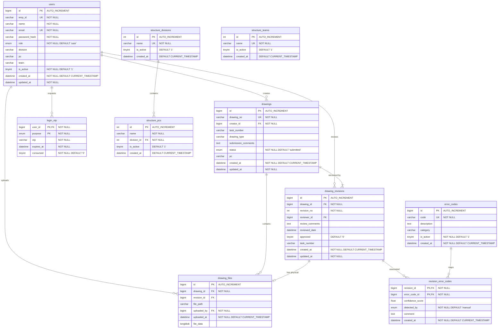

# Atlas Copco DrawLogAI: Phase 6 - Database Reverse Engineering

This document provides a detailed structural, semantic, and relational audit of the MySQL database (`atlascopco_drawing_db`) for **Atlas Copco DrawLogAI** based on [DrawLogAI-DB.sql](file:///c:/Atlas-Copco-DrawLogAI/DrawLogAI-DB.sql).

---

## 1. Database Entity-Relationship Diagram (ERD)

The following diagram illustrates the tables, column datatypes, primary keys (PK), foreign keys (FK), and unique constraints.

---

## 2. Table-by-Table Schema Analysis

---

### A. users
* **Purpose:** Stores employee profile parameters, authorization levels, and passwords hashes.
* **Columns:**
  * `id` (bigint, PK, auto_increment): Internal surrogate key.
  * `emp_id` (varchar(50), UK, not null): Corporate employee ID (e.g. `EMP_01`).
  * `name` (varchar(255), not null): Full name.
  * `email` (varchar(255), UK, not null): Email.
  * `password_hash` (varchar(255), not null): BCrypt hashed password string.
  * `role` (enum('admin', 'user'), default 'user'): Maps to UI access types (`HR` or `Employee`).
  * `division`, `pc`, `team` (varchar): Organizational structures mappings.
  * `is_active` (tinyint(1), default 1): Flag for soft deactivation.
* **Relationships:** Parent table for `drawings.creator_id`, `drawing_revisions.reviewer_id`, `drawing_files.uploaded_by`, and `login_otp.user_id`.
* **Business Importance:** Critical. Controls authentication, role authorization, and organizational structure mapping for audit accountability.

---

### B. drawings
* **Purpose:** Catalogs registered drawings by design ID.
* **Columns:**
  * `id` (bigint, PK, auto_increment): Surrogate drawing key.
  * `drawing_no` (varchar(100), UK, not null): Corporate part/drawing number (e.g., `DR_9097556546`).
  * `creator_id` (bigint, FK, not null): Links to `users.id` (designer).
  * `task_number` (varchar(100)): ERP/Project task code.
  * `drawing_type` (varchar(255)): Category (e.g. Sheet Metal, Casted Machined).
  * `submission_comments` (text): Remarks added during submission.
  * `status` (enum('submitted', 'under_review', 'approved', 'rejected')): Current review state.
  * `pc` (varchar(50)): Associated Product Company.
* **Relationships:** Child of `users`. Parent to `drawing_revisions` and `drawing_files`.
* **Business Importance:** Critical. This is the master ledger of all drawings processed by Atlas Copco design teams.

---

### C. drawing_revisions
* **Purpose:** Logs drawing audit cycles, reviewer comments, and final decisions.
* **Columns:**
  * `id` (bigint, PK, auto_increment): Unique revision identifier.
  * `drawing_id` (bigint, FK, not null): Reference to `drawings.id`.
  * `revision_no` (int, not null): Revision index (e.g. `1`, `2`, `3`).
  * `reviewer_id` (bigint, FK): Reference to `users.id` (auditor).
  * `review_comments` (text): Extracted text notes JSON.
  * `reviewed_date` (datetime): Completion timestamp.
  * `approved` (tinyint(1), default 0): Review status flag.
  * `task_number` (varchar(50)): Tracking code.
* **Relationships:** Child of `drawings` and `users`. Parent to `drawing_files` and `revision_error_codes`.
* **Business Importance:** Critical. Serves as the primary audit trail for compliance verification and historical drawing analysis.

---

### D. drawing_files
* **Purpose:** Stores the physical PDF binaries for each drawing revision.
* **Columns:**
  * `id` (bigint, PK, auto_increment): Unique record ID.
  * `drawing_id` (bigint, FK, not null): Parent drawing record.
  * `revision_id` (bigint, FK): Links to specific revision.
  * `file_path` (varchar(500)): Local file path reference.
  * `uploaded_by` (bigint, FK, not null): Reference to `users.id` (uploader).
  * `file_data` (longblob): PDF file binary content.
* **Relationships:** Child of `drawings`, `drawing_revisions`, and `users`.
* **Business Importance:** High. Stores drawing assets (PDFs). Since files are stored directly as BLOBs, database sizes must be managed carefully.

---

### E. error_codes
* **Purpose:** Standard list of drawing errors for categorization.
* **Columns:**
  * `id` (bigint, PK, auto_increment): Surrogate key.
  * `code` (varchar(50), UK, not null): Standard error code identifier (e.g., `E_101`).
  * `description` (text): Definition of the design error.
  * `category` (varchar(100)): Broad categorization.
  * `is_active` (tinyint(1), default 1): Flag to enable/disable selection.
* **Relationships:** Parent to `revision_error_codes`.
* **Business Importance:** High. Standardizes error codes for analytics and reports.

---

### F. revision_error_codes
* **Purpose:** Maps specific error codes to a drawing revision.
* **Columns:**
  * `revision_id` (bigint, PK, FK, not null): Linked drawing revision.
  * `error_code_id` (bigint, PK, FK, not null): Linked error code.
  * `confidence_score` (float): AI model probability scoring.
  * `detected_by` (enum('AI', 'manual'), default 'manual'): Identification source flag.
  * `comment` (text): Specific contextual remarks.
* **Relationships:** Junction table linking `drawing_revisions` to `error_codes`.
* **Business Importance:** High. Records the details of mistakes flagged manually or detected by AI, which is the source data for quality analytics charts.

---

### G. login_otp
* **Purpose:** Temporary storage for security OTP codes.
* **Columns:**
  * `user_id` (bigint, PK, FK, not null): Target user.
  * `purpose` (enum('first_login', 'password_reset'), PK, not null): Transaction context.
  * `otp` (varchar(100), not null): Bcrypt-hashed code.
  * `expires_at` (datetime, not null): Expiration threshold.
  * `consumed` (tinyint(1), default 0): Single-use flag.
* **Relationships:** Child of `users`.
* **Business Importance:** Medium. Handles password resets securely.

---

### H. structure_divisions, structure_pcs, structure_teams
* **Purpose:** Manages divisions, Product Companies, and teams.
* **Columns:**
  * `id` (int, PK, auto_increment): Surrogate primary key.
  * `name` (varchar(255), UK, not null): Division/PC/Team name.
  * `division_id` (int, FK, not null - for `structure_pcs` only): Reference to division.
  * `is_active` (tinyint(1), default 1): Status flag.
* **Relationships:** `structure_pcs` is a child of `structure_divisions`.
* **Business Importance:** Medium. Organizes quality reports dynamically by business units.

---

## 3. Database Constraints & Keys Index

### A. Primary Keys (PK)
* `users(id)`, `drawings(id)`, `drawing_revisions(id)`, `drawing_files(id)`
* `error_codes(id)`, `structure_divisions(id)`, `structure_pcs(id)`, `structure_teams(id)`
* Compound Primary Keys:
  * `revision_error_codes(revision_id, error_code_id)`
  * `login_otp(user_id, purpose)`

### B. Foreign Keys (FK) & Cascades

| Child Table | FK Column | Parent Table | Cascade Rule |
| :--- | :--- | :--- | :--- |
| `drawings` | `creator_id` | `users(id)` | `ON DELETE RESTRICT` |
| `drawing_revisions` | `drawing_id` | `drawings(id)` | `ON DELETE CASCADE` |
| `drawing_revisions` | `reviewer_id` | `users(id)` | `ON DELETE SET NULL` |
| `drawing_files` | `drawing_id` | `drawings(id)` | `ON DELETE CASCADE` |
| `drawing_files` | `revision_id` | `drawing_revisions(id)` | `ON DELETE CASCADE` |
| `drawing_files` | `uploaded_by` | `users(id)` | `ON DELETE RESTRICT` |
| `revision_error_codes`| `revision_id` | `drawing_revisions(id)`| `ON DELETE CASCADE` |
| `revision_error_codes`| `error_code_id`| `error_codes(id)` | `ON DELETE RESTRICT` |
| `login_otp` | `user_id` | `users(id)` | `ON DELETE CASCADE` |
| `structure_pcs` | `division_id` | `structure_divisions(id)`| `ON DELETE CASCADE` |

### C. Unique Constraints (UK)
* `users(emp_id)`, `users(email)`
* `drawings(drawing_no)`
* `drawing_revisions(drawing_id, revision_no)` (enforces one revision count per drawing)
* `error_codes(code)`
* `structure_divisions(name)`, `structure_teams(name)`
* `structure_pcs(name, division_id)` (prevents duplicate Product Companies inside the same Division)

### D. System Indexes
* `drawing_files`: `idx_files_drawing` (`drawing_id`), `idx_files_revision` (`revision_id`)
* `drawing_revisions`: `idx_revision_drawing` (`drawing_id`), `idx_revision_reviewer` (`reviewer_id`)
* `drawings`: `idx_drawings_creator` (`creator_id`)
* `revision_error_codes`: `idx_rec_error` (`error_code_id`)

### E. Stored Procedures, Views, & Triggers
* **Analysis:** The database schema dump contains **no** stored procedures, views, or triggers. All relational triggers, cascading updates, and data queries are executed dynamically inside the Python application.

---

## 4. Identification of Critical Tables

1. **`drawing_files` (Storage Bottleneck):** Stores drawing PDFs as `LONGBLOB` fields. This table will consume the most storage space over time, requiring database memory optimizations.
2. **`drawing_revisions` (Audit Ledger):** Central log table for drawing reviews. If corrupted, all historical drawing comments and approvals are lost.
3. **`users` (Security Boundary):** Manages user credentials. It must be protected to ensure only authorized employees can access drawing reviews.
