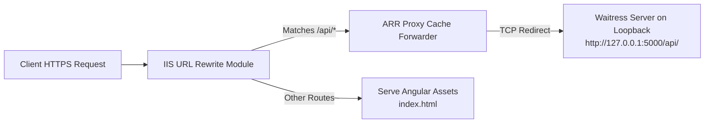
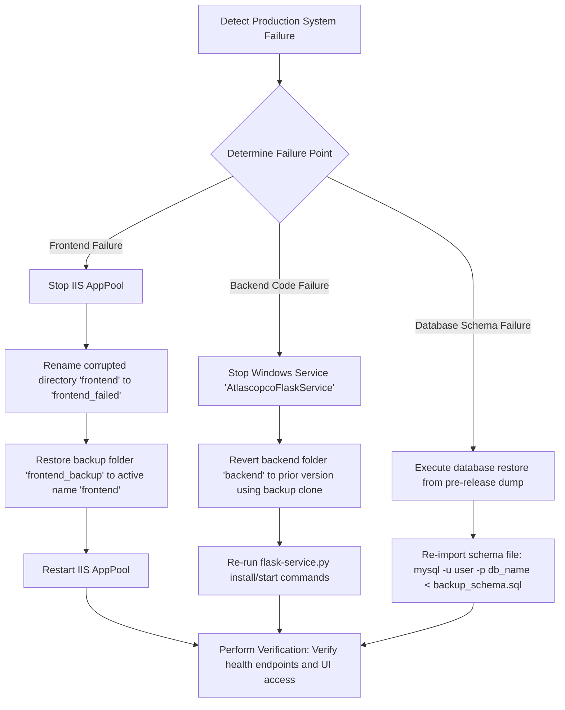

# Atlas Copco DrawLogAI: Phase 9 - Deployment & CI/CD Analysis

This document details the build execution process, release pipelines, IIS server configurations, host requirements, and rollback strategies for the **Atlas Copco DrawLogAI** platform.

---

## 1. System Deployment Architecture

The following diagram illustrates the deployment topology from the development/build tier to the final hosting environment.

```mermaid
graph TD
    subgraph Developer / Build Environment
        DevSrc[Source Code Repository]
        LocalBuild[npm run build --prod]
        ZipPacker[Create dist.zip<br/>*Exclude web.config*]
        
        DevSrc --> LocalBuild
        LocalBuild --> ZipPacker
    end

    subgraph Production VM Server (10.91.17.78)
        IISDist[IIS Web Directory<br/>C:/inetpub/atlascopco-app/frontend/]
        WaitressDir[Waitress Directory<br/>C:/inetpub/atlascopco-app/backend/]
        PythonVenv[Python Virtual Env<br/>venv/Scripts/python.exe]
        MySQLServer[(MySQL Server Daemon<br/>Port 3306)]
        
        ZipPacker -->|Copy & Extract| IISDist
        WaitressDir --> PythonVenv
    end

    subgraph Server Process Controller
        TaskSched[Windows Task Scheduler<br/>or Windows Service]
        TaskSched -->|Launch wsgi.py| PythonVenv
    end

    subgraph Corporate Network
        DNS[Internal DNS Server<br/>drawlogai.atlascopco.group]
        Client[Auditor / Designer Browser]
        
        Client -->|DNS Query| DNS
        Client -->|TCP 443 / HTTPS| IISDist
    end
```

---

## 2. The Build & Release Process

The deployment process is **semi-automated/manual**, relying on file compilation, archiving, and remote system copies.

### A. Frontend Build Pipeline
1. **Target Routing Config:** Verify the API endpoint inside `src/environments/environment.ts` is configured to route traffic to the production domain:
   ```typescript
   export const environment = {
     production: true,
     apiUrl: 'https://drawlogai.atlascopco.group/api'
   };
   ```
2. **NPM Build Compiling:** Execute compilation on the build machine:
   ```bash
   npm install
   npm run build --prod
   ```
   This generates compiled files (HTML, JS bundles, CSS, assets) in the `dist/<app-name>/` directory.
3. **Packaging:** Compress the contents of the `dist/` directory into `dist.zip`.
   > [!IMPORTANT]  
   > **Do not include `web.config` in this zip package.** The VM team maintains the `web.config` configuration (URL Rewrite rules and proxy parameters) directly on the IIS server to prevent overwriting active IIS bindings.

### B. Release & Deployment Pipeline
1. **Copy Zip Bundle:** Transfer `dist.zip` to the production server (IP: `10.91.17.78`).
2. **IIS Directory Update:** Extract the zip file directly into the IIS root path:
   ```cmd
   C:\inetpub\atlascopco-app\frontend\
   ```
3. **Backend Service Update:**
   * If updates occur in python APIs, copy source folders to:
     ```cmd
     C:\inetpub\atlascopco-app\backend\
     ```
   * Activate the virtual environment and install changes:
     ```cmd
     cd C:\inetpub\atlascopco-app\backend\
     python -m venv venv
     venv\Scripts\activate
     pip install -r requirements.txt
     ```
4. **App Service Restart:** Restart the Waitress WSGI process running as the Windows service `AtlascopcoFlaskService`:
   ```bash
   python flask-service.py restart
   ```

---

## 3. Server Configuration & Environment Setup

### A. System Requirements

* **Operating System:** Windows Server 2019 / 2022 / 2025.
* **Database Engine:** MySQL Server 8.0+.
* **Runtimes:**
  * Python 3.8+ (with pip)
  * Node.js & NPM (required on build machines)
* **IIS Version:** IIS 10 with:
  * CGI & WebSocket Protocols enabled.
  * URL Rewrite Module 2.1.
  * Application Request Routing (ARR) Module 3.0.
* **Hardware Sizing:** Minimum 4 Core CPU and 8GB RAM to ensure processing speed for PyMuPDF text parsing, Scikit-Learn TF-IDF model loading, and LONGBLOB PDF storage operations.

### B. IIS Proxy Routing Flow

To map API requests to the Python WSGI server, IIS uses ARR URL Rewrite rules in the server's `web.config`.



#### IIS Site Configurations:
* **Physical directory path:** `C:\inetpub\atlascopco-app\frontend\`
* **IP Bindings:** IP: `10.91.17.78`, Port: `80` (with HTTP redirects) and Port: `443` (configured with SSL certificates).
* **ARR Configuration:** In IIS Manager, select server name -> click **Application Request Routing Cache** -> open **Server Proxy Settings** -> check **Enable proxy** -> click **Apply**.

---

## 4. Network Setup & Firewalls

### A. DNS Entry Requirements
The IT team managing the `atlascopco.group` domain configures a DNS host record mapping the hostname to the IIS server:
* **Record Name (Subdomain):** `drawlogai`
* **Record Type:** `A (Host)`
* **Points to (IP):** `10.91.17.78`
* **Resulting domain:** `drawlogai.atlascopco.group`

### B. Windows Firewall Rules
PowerShell commands are used to allow web traffic past Windows Server security firewalls:
```powershell
# Open HTTP Inbound (Port 80)
New-NetFirewallRule -DisplayName "HTTP Inbound" -Direction Inbound -Protocol TCP -LocalPort 80 -Action Allow

# Open HTTPS Inbound (Port 443)
New-NetFirewallRule -DisplayName "HTTPS Inbound" -Direction Inbound -Protocol TCP -LocalPort 443 -Action Allow
```

---

## 5. Rollback Process

In the event of a deployment failure, follow the rollback workflow below:



### Rollback Standard Operating Procedure (SOP):
1. **Pre-Release Backup (Mandatory):**
   * Before deploying any release, clone the active directories `C:\inetpub\atlascopco-app\frontend` and `backend` as backup copies on the server filesystem.
   * Run a MySQL database dump to capture schema states:
     ```bash
     mysqldump -u root -p atlascopco_drawing_db > backup_schema.sql
     ```
2. **Frontend Rollback:** Stop the IIS site, rename the current folder, restore the backup directory to `frontend`, and restart the site.
3. **Backend Rollback:** Stop the `AtlascopcoFlaskService` service, restore the backup code directory, and restart the service.
4. **Database Rollback:** If a migration script fails, restore the pre-release SQL dump.
