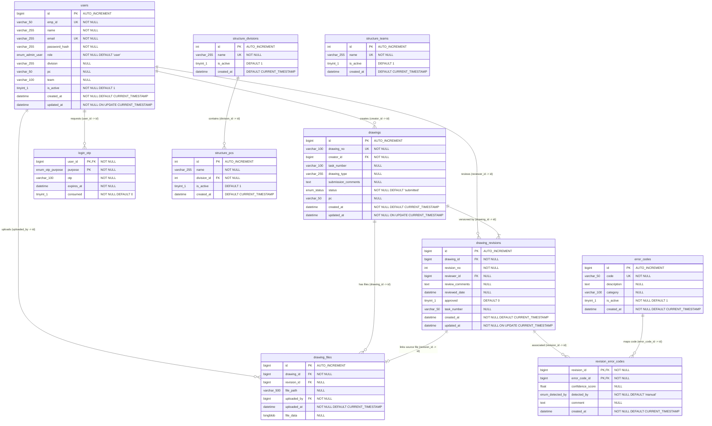

# Atlas Copco DrawLogAI: Database ER Diagram

This document contains both the high-resolution visual database Entity-Relationship (ER) diagram chart and the Mermaid configuration code matching your production database schema (`atlascopco_drawing_db`).

---

## 1. Visual ER Diagram Chart

Below is the generated high-resolution ER diagram chart image. You can open and print this image directly for physical documentation:

*The physical image is saved locally at: `c:\Atlas-Copco-DrawLogAI\docs\database_er_diagram.png`*

---

## 2. Relational Mermaid Configuration Code

In case you need to edit the schema relationships or re-generate the diagram textually, here is the raw code definition:

