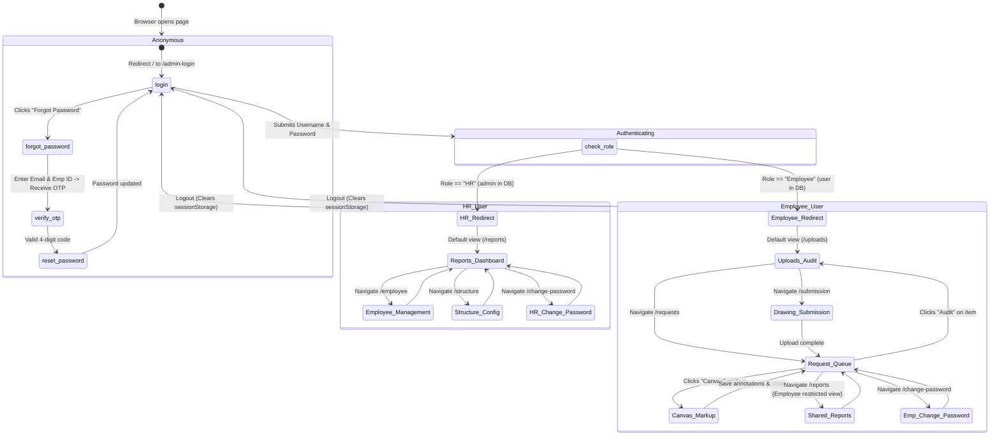

# Atlas Copco DrawLogAI: Phase 4 - Frontend Deep Analysis

This document provides a comprehensive structural, logical, and routing analysis of the Angular-based frontend application for **Atlas Copco DrawLogAI**.

---

## 1. Technical Architecture Stack

### A. Framework Used
* **Angular Core:** Built on **Angular v16.1.4**.
* **Language:** **TypeScript** compiled down to standard JavaScript modules.
* **Component Engine:** Decorator-driven `@Component` views linking separate HTML templates, SCSS stylesheets, and TS logic files.

### B. Routing Structure
Client routing is handled programmatically via the standard Angular [AppRoutingModule](file:///c:/Atlas-Copco-DrawLogAI/frontend/src/app/app-routing.module.ts). 
* **Route Constraints (Guards):** Every sensitive route is protected by `AuthGuard` which reads permissions configuration rules passed as `data: { roles: ['HR', 'Employee'] }`.
* **Token Interceptors:** Outbound calls to the Flask API are modified by the [AuthInterceptor](file:///c:/Atlas-Copco-DrawLogAI/frontend/src/app/auth.interceptor.ts) to verify session validity. If the session expires, the interceptor cancels requests and redirects the browser back to `/admin-login`.

### C. State Management
* **Session Storage:** DrawLogAI implements a local session state using `sessionStorage` under the key `session`.
* **State Persistence:** The session structure is defined by `SessionState` containing `username` (Employee ID), `fullName`, `accessType` (`HR` or `Employee`), and a unix `loginTime` timestamp.
* **Rolling/Max Caps:** A session has a hard limits cap of 8 hours, managed in [AuthService](file:///c:/Atlas-Copco-DrawLogAI/frontend/src/app/auth.service.ts). If client requests occur past this limit, they are automatically logged out.

### D. API Integration
* **HTTP Client:** Uses Angular's `@angular/common/http` module via `HttpClient`.
* **Dynamic API Paths:** The API target url is read from `src/environments/environment.ts` (specifically `environment.apiUrl` which directs requests to `https://drawlogai.atlascopco.group/api` in production).

### E. Authentication & Authorization Flows
1. **Login Request:** User submits credentials via the `AdminLoginComponent`. The payload is POSTed to the backend `/admin-login` endpoint.
2. **Access Control:** The backend maps database `admin` to the access type `HR` and `user` to `Employee`. The frontend `AuthService` stores this role.
3. **Guard Validation:** As users click on links, the [AuthGuard](file:///c:/Atlas-Copco-DrawLogAI/frontend/src/app/auth.guard.ts) intercepts navigation. It checks if the current role exists in the target route's `roles` array. Unauthorised attempts trigger automatic redirects:
   * **HR User** attempting Employee routes redirects to `/reports`.
   * **Employee User** attempting HR routes redirects to `/uploads`.

### F. Form Handling
* **Template-Driven Forms:** Primarily utilizes Angular's `NgForm` controls and inputs binding directives (`ngModel`).
* **Validation:** Custom logic validates fields (e.g. Employee ID strings, email formats, password characters complexity, and drawing naming syntax checks).

### G. Error Handling
* **Client-Side Notifications:** Integrating **SweetAlert2** (`Swal`) provides overlays for error alerts, status prompts, and upload summaries.
* **Server-Side Fallbacks:** Backend error codes are intercepted by `HttpClient` error handlers, mapping them into user-friendly diagnostic alert notifications.

---

## 2. Page Navigation Diagram & Theory

Below is the routing state transitions diagram for the platform.

### Routing Theory:
* **Default Fallback:** Navigating to an invalid path triggers a redirect back to `/admin-login`.
* **Guard Redirection:** If an authenticated user enters the login URL, the system redirects them to their respective default home workspace.
* **Canvas Bridging:** The `CanvasComponent` is bridged with the `RequestsComponent` using Angular Router `history.state` or path query parameters (`drawing_id` and `revision`), ensuring seamless state transfer.

---

## 3. Comprehensive View Page Analysis

---

### A. Login Page (AdminLoginComponent)
* **Purpose:** Handles initial security gatekeeper login checks.
* **Inputs:**
  * User credentials form: Username (Employee ID, e.g., `EMP_001`), Password.
* **Outputs:**
  * Session object saved in LocalStorage / SessionStorage.
  * Router navigation to `/reports` (HR) or `/uploads` (Employee).
* **API Calls:**
  * `POST /admin-login`: Verifies username and bcrypt hashed password.
* **Dependencies:** `AuthService`, Router, HttpClient, SweetAlert2.

---

### B. Forgot Password Page (ForgotPasswordComponent)
* **Purpose:** Public portal allowing users to reset their forgotten passwords via email-verified 4-digit OTP.
* **Inputs:**
  * Form 1: Employee ID, registered email.
  * Form 2: 4-digit OTP token.
  * Form 3: New Password, Confirm Password.
* **Outputs:**
  * Navigates back to `/admin-login` upon successful password changes.
* **API Calls:**
  * `POST /auth/forgot-password/initiate`: Sends OTP email.
  * `POST /auth/forgot-password/verify`: Checks OTP expiration and signature validity.
  * `POST /auth/forgot-password/reset`: Commits new password to DB.
* **Dependencies:** Router, HttpClient, Forms Module, SweetAlert2.

---

### C. Change Password Page (ChangePasswordComponent)
* **Purpose:** Allows logged-in users to update their password.
* **Inputs:**
  * Form: Current Password, New Password, Confirm Password.
* **Outputs:**
  * Modal confirmation; redirects to login page or logs out session.
* **API Calls:**
  * `POST /auth/change-password`: Verifies current credentials and commits new hash.
* **Dependencies:** `AuthService`, Router, HttpClient, SweetAlert2.

---

### D. Drawing Submission Page (SubmissionComponent)
* **Purpose:** Allows drawing designers (Employees) to register new drawings or upload updated revisions.
* **Inputs:**
  * Form elements: Creator Employee ID (autofilled), Reviewer ID (Dropdown), PC, Drawing Type, Task Number, Comments, Design Number, Revision Number.
  * File selection: One or more PDF drawings.
* **Outputs:**
  * Trigger request payload to `/submit-batch`.
  * Renders a custom submission results modal (New drawings added count, revisions updated count, naming skipped items).
  * Prompts for Special Case overrides for alphanumeric drawing titles.
* **API Calls:**
  * `GET /get-employees`: Fetches active user IDs for Reviewer dropdown selection.
  * `GET /get-employee/<emp_id>`: Fetches Creator department detail keys (PC, Division, Team).
  * `POST /submit-batch`: Handles batch file uploads and creates drawing records.
* **Dependencies:** `AuthService`, HttpClient, Forms module, SweetAlert2.

---

### E. Uploads / Drawing Audit Page (UploadsComponent)
* **Purpose:** Main screen for Auditors (Employees) to analyze drawings, run AI predictions, and submit final approvals or rejections.
* **Inputs:**
  * Query parameters: `drawing_id`, `revision` (optional pre-fill parameters).
  * Form parameters: Auditor, Date, Design Number, Revision, PC, Division, Team.
  * PDF Upload file selector.
  * Error Log interactive Table: allows manually adding, editing, or deleting parsed error codes.
* **Outputs:**
  * Displays extracted comments list and AI-predicted error code classifications.
  * Triggers submit review payload.
* **API Calls:**
  * `GET /prefill-upload`: Prefills form details based on current drawing parameters.
  * `POST /upload`: Sends PDF drawing, extracts annotations, and runs ML classifier.
  * `POST /submit`: Saves the final review, updates status, and dispatches creator alerts.
  * `GET /get-employees` & `GET /get-employee/<emp_id>`: Fetches designer profile details.
* **Dependencies:** Router, ActivatedRoute, HttpClient, ChangeDetectorRef, SweetAlert2.

---

### F. Interactive Drawing Canvas (CanvasComponent)
* **Purpose:** Graphical drawing workspace where reviewers add annotations, stamps, and drawings on the PDF page.
* **Inputs:**
  * State variables: `drawingId` and `revision` passed through router state.
  * Markup tools: View mode, Select tool, Text annotation, Stamps placement, Pen sketch.
  * Stamp options: Approved, Rejected, Reviewed, Correct checkmark, Wrong cross mark.
  * Mouse cursor coords: `x`, `y` coordinates (normalized based on page viewport aspect ratio).
* **Outputs:**
  * Annotation elements overlayed dynamically on top of the PDF.js frame.
  * Interactive PDF downloads with embedded free-text stamps and checkmarks.
* **API Calls:**
  * `GET /drawings/<drawing_id>/<revision>/pdf/view`: Feeds PDF binary bytes to PDF.js.
  * `POST /annotations/<drawing_id>`: Saves annotation items coordinates JSON.
  * `GET /annotations/<drawing_id>`: Re-loads annotations JSON list.
  * `POST /drawings/<drawing_id>/<revision>/pdf/annotated/upload`: Replaces stored PDF file.
  * `POST /drawings/<drawing_id>/<revision>/pdf/annotated/download`: Bakes annotations onto the original PDF.
* **Dependencies:** `pdfjs-dist` (PDF.js loader), HttpClient, Router, ActivatedRoute.

---

### G. Requests Queue Page (RequestsComponent)
* **Purpose:** Audit tracking workspace showing drawing queues, separated by role.
* **Inputs:**
  * Filter text: searches drawing numbers.
  * Segment switcher: "My Submissions" vs "Audits Pending/Completed".
* **Outputs:**
  * Tabular drawing revision records.
  * Action buttons: Navigate to uploads audit page, open drawing inside canvas, delete request, or download files.
* **API Calls:**
  * `GET /requests/creator/<emp_id>`: Lists submissions created by this employee.
  * `GET /requests/reviewer/<emp_id>`: Lists audits assigned to this reviewer.
  * `DELETE /requests/delete/<drawing_id>/<revision>`: Removes drawing revision from queue.
  * `GET /drawings/<drawing_id>/<revision>/pdf/download`: Downloads files.
* **Dependencies:** Router, HttpClient, SweetAlert2, `AuthService`.

---

### H. Reports & Dashboard Page (ReportsComponent)
* **Purpose:** Hosts analytical statistics dashboards and quality trends charts.
* **Inputs:**
  * Dashboard filters: Start/End Date, Team selector, PC selector.
* **Outputs:**
  * KPI totals: Total Audits, Pass Ratio (%).
  * Charts: Bar charts, Column charts, Line charts, Treemaps.
  * Tabular Lists: Task details sheets, auditor logs.
* **API Calls:**
  * `GET /api/overview-dashboard`: Retrieves baseline metrics, leaderboard, and recent audits list.
  * `GET /api/monthly-drawing-status`: Feeds Monthly Drawing Status trend chart.
  * `GET /api/monthly-error-report`: Feeds monthly error counts chart.
  * `GET /api/trend-error-report`: Feeds top error codes pareto chart.
  * `GET /api/employee-drawing-status`: Feeds employee performance column chart.
  * `GET /api/error-summary`: Summarizes error metrics for select employees/drawings/teams.
  * `GET /api/task-report`: Feeds filtered task reports spreadsheet.
  * `GET /api/employees-dropdown`, `GET /api/drawings-dropdown`, `GET /api/tasks-dropdown`: Feeds filter dropdowns.
  * `GET /api/structure/teams` & `GET /api/structure/pcs`: Populates filter checkboxes.
* **Dependencies:** HttpClient, Router, Chart components (`LineChartComponent`, `ColumnChartComponent`, `BarChartComponent`).

---

### I. Structure Page (StructureComponent)
* **Purpose:** HR workspace to add/remove divisions, Product Companies, and teams.
* **Inputs:**
  * Input Form: New Division, PC (assigned to Division), or Team name.
* **Outputs:**
  * Adds row to DB tables and re-renders lists.
* **API Calls:**
  * `GET` / `POST` / `DELETE` on `/api/structure/divisions`.
  * `GET` / `POST` / `DELETE` on `/api/structure/pcs`.
  * `GET` / `POST` / `DELETE` on `/api/structure/teams`.
* **Dependencies:** HttpClient, Forms Module.

---

### J. Employee Page (EmployeeComponent)
* **Purpose:** User account management view for HR.
* **Inputs:**
  * Input Form: Emp_ID, Name, Email, Division, PC, Team.
* **Outputs:**
  * Database user records creation, edits, or soft deletes.
  * Sends welcome credentials emails automatically.
* **API Calls:**
  * `GET /fetch-all-employees`: Lists all users.
  * `POST /add-employee`: Creates credentials.
  * `POST/PUT /edit-employee`: Edits fields.
  * `DELETE /delete-employee/<emp_id>`: Soft-deletes users.
  * `GET /api/structure/divisions`, `/api/structure/pcs`, `/api/structure/teams`: Populates option select items.
* **Dependencies:** HttpClient, Forms Module, SweetAlert2.
