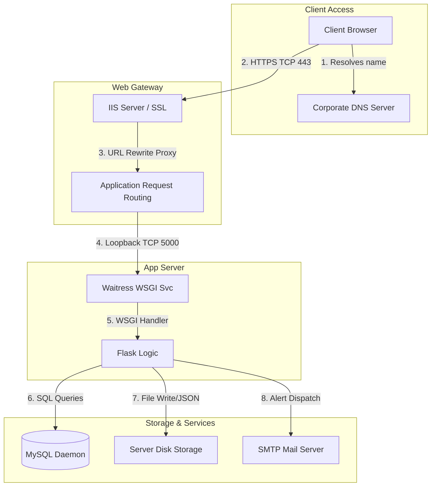

# Atlas Copco DrawLogAI: Phase 10 - Infrastructure Analysis

This document provides a detailed catalog of the physical and virtual infrastructure supporting **Atlas Copco DrawLogAI**. We analyze hosting providers, domain networks, storage subsystems, backup/monitoring profiles, and server-side system dependencies.

---

## 1. Infrastructure Catalog

### A. Servers
* **Virtual Host Machine:** Single Windows Server VM (running Windows Server 2019/2022/2025).
* **Network Sizing:** IP address `10.91.17.78` (on-premise private class A address).
* **Hosted Applications:**
  * **Web/Proxy Server:** IIS (Internet Information Services) 10.
  * **Application Server:** Waitress WSGI running Python 3.8+ on loopback socket `127.0.0.1:5000`.

### B. Domains & DNS
* **Production Domain:** `drawlogai.atlascopco.group`
* **DNS Resolution:** Private internal DNS server hosting an `A (Host)` record pointing `drawlogai` to server IP `10.91.17.78` with a TTL of 3600 seconds.

### C. SSL Certificates
* **Certificate Authority:** Signed by the organization's private Certificate Authority (CA) or standard wildcards (`*.atlascopco.group`).
* **IIS Configuration:** Certificate imported to the Server's Personal Certificate Store via Microsoft Management Console (`mmc.exe`). Bound to port `443` on IIS with Server Name Indication (SNI) enabled.

### D. Hosting Providers
* Private internal Hypervisor platform (such as VMware ESXi or Microsoft Hyper-V) hosted on-premise and managed by the Atlas Copco IT infrastructure team.

### E. Database Servers
* **Database Engine:** MySQL Server 8.0+.
* **Instance Binding:** Binds locally on standard TCP port `3306` inside the same VM (or a private DB cluster).

### F. Load Balancers
* **Status:** **None implemented.** The site utilizes a single VM server.
* **Proxy Routing:** IIS utilizes Application Request Routing (ARR) 3.0 to handle reverse-proxy routing of API traffic locally, but there is no multi-node load balancing.

### G. Storage Systems
* **File Directory Storage:** Local server volumes:
  * Static web build path: `C:\inetpub\atlascopco-app\frontend\`
  * Python backend path: `C:\inetpub\atlascopco-app\backend\`
  * Stored canvas annotations path: `uploads/annotations/` (stored as JSON files).
* **Database Blob Storage:** Physical drawings (PDFs) are stored as binary payloads (`LONGBLOB` fields in the `drawing_files` table) inside MySQL databases directories.

### H. Backup Systems
* **Database Backup:** Manual dump scripts:
  ```bash
  mysqldump -u root -p atlascopco_drawing_db > backup_schema.sql
  ```
* **Folder Backups:** Manual copies of directory assets before upgrades.
* **VM Snapshots:** Standard daily virtual machine snapshots managed at the hypervisor level (VMware/Hyper-V) by the VM IT team.

### I. Monitoring Systems
* **Application Level:** **None integrated** inside the application.
* **Operating System Level:** Standard Windows tools:
  * **Windows Event Viewer:** Monitors Application Logs for issues related to the `AtlascopcoFlaskService` service.
  * **Task Manager / Performance Monitor:** Tracks CPU and memory utilization.

### J. Logging Systems
* **IIS Logs:** Located at `C:\inetpub\logs\LogFiles\`. Logs HTTP response codes and ARR request forwards.
* **Flask Logs:** The WSGI process outputs standard logs to stdout/stderr. These are captured under the Windows Application Event log by the Windows Service wrapper (`flask-service.py`).

---

## 2. Infrastructure Dependency Mappings

The DrawLogAI platform is built on sequential system dependencies. If any component in the chain fails, it affects other modules downstream.



### Dependency Failure Impact Matrix:

| Failed Component | Immediate Symptom | Downstream Impact | Diagnostic Source |
| :--- | :--- | :--- | :--- |
| **DNS Server** | Browser returns `DNS_PROBE_FINISHED_NXDOMAIN`. | Users cannot resolve `drawlogai.atlascopco.group` and cannot load the site. | `nslookup`, local `hosts` fallback. |
| **IIS Server** | Connection Timeout or `404 Not Found`. | Frontend pages fail to load. ARR proxy routes cannot resolve. | IIS Status console, Event Viewer. |
| **Waitress Service** | IIS returns `502 Bad Gateway` on API calls. | Frontend loads, but logins, submissions, and dashboard charts fail. | Windows Event Viewer (`AtlascopcoFlaskService`), `flask-service.py status`. |
| **MySQL Server** | Flask API returns `500 Internal Server Error`. | Flask connections (`before_request` hooks) raise database errors. Logins and audits fail. | MySQL Daemon status, Flask Service logs. |
| **SMTP Server** | Review emails are not sent. | Audit transitions complete, but designers are not notified about rejected/approved drawings. | Flask stdout log (`Failed to send email`). |
| **Server Disk Space** | Database locks. Flask cannot save uploads. | Deleting annotations JSON files fails. MySQL crashes due to disk space exhaustion from PDF blobs. | Windows Disk Properties. |
