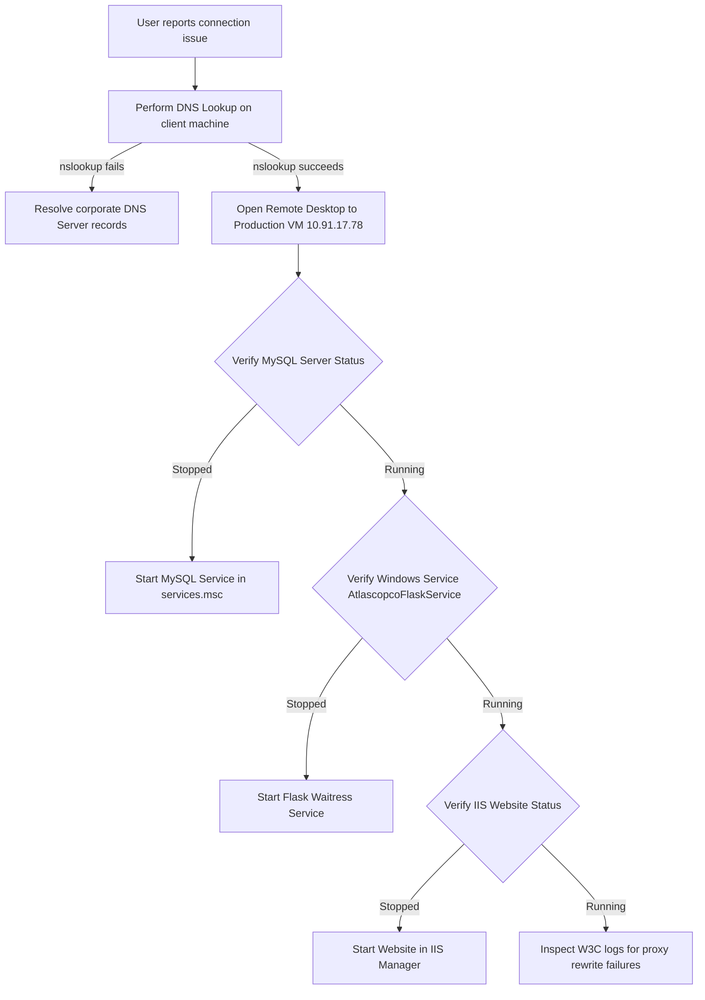

# Atlas Copco DrawLogAI: Phase 12 - Observability Analysis

This document outlines the logging pathways, monitoring baselines, quality metrics, alert guidelines, and issue investigation Standard Operating Procedures (SOP) for **Atlas Copco DrawLogAI**.

---

## 1. Observability Profile

### A. Logging Pathways
The system generates logs across multiple layers of the technology stack:

* **1. IIS Access & Routing Logs:**
  * **Default Path:** `C:\inetpub\logs\LogFiles\W3SVC1\` (standard W3C format).
  * **Logged Details:** Client IP, Request URL paths, HTTP response status codes (e.g., 200, 502, 404), bytes transferred, and latency.
* **2. Python Application Console Logs:**
  * **Default Path:** Captured in the **Windows Event Viewer** under Application Logs (Source: `AtlascopcoFlaskService` or `Python`).
  * **Logged Details:** Unbuffered server prints, database connection successes, file upload sizes, ML predictions arrays, and full traceback errors for uncaught exceptions.
* **3. Database Server Logs:**
  * **Default Path:** Configured in the MySQL configuration file (`my.ini`), typically stored in the MySQL data directory.
  * **Logged Details:** Slow queries, connection timeouts, packet size errors, and startup/shutdown events.

### B. Monitoring & Resource Metrics
Resource consumption is monitored at the host operating system level:
* **Host Resource Metrics:** Windows Performance Monitor (`perfmon.msc`) tracks CPU utilization (overall and per-process), RAM allocation, disk read/write IOPS, and network bandwidth.
* **Application Services Metrics:** Windows Task Manager tracks specific processes:
  * `python.exe` (Waitress WSGI processes) - monitors CPU and RAM.
  * `mysqld.exe` (MySQL service daemon) - tracks memory usage to prevent database resource starvation.
* **Data Volume Sizing:** Database file directory sizes (specifically the database storage partition) must be monitored since drawing PDFs are saved directly inside MySQL tables.

### C. Alerts & Notifications
Alerts are managed using standard Windows Server OS warning triggers:
* **Service State Alerts:** Configure alerts in Task Scheduler or third-party server monitors to send notifications if the service state of `AtlascopcoFlaskService` or `MySQL80` changes to **STOPPED**.
* **System Resource Threshold Alerts:** Trigger alerts if:
  * VM Disk partition space falls below **15%**.
  * CPU utilization exceeds **90%** for more than 10 consecutive minutes.
  * Memory utilization exceeds **95%**.

### D. Quality & Business Dashboards
* **Frontend Reports Dashboard (`/reports`):** Provides a visual summary of the platform's performance:
  * **Quality KPIs:** Total audited drawings counts, pass ratios (%), and pending queue sizes.
  * **Team Performance Treemaps:** Compares accepted and rejected drawing counts across teams.
  * **Auditor Leaderboard:** Tracks audit volume rankings per reviewer.
  * **Error Pareto Metrics:** Displays a Pareto chart of the top 10 most common error codes, helping identify where design issues occur.

---

## 2. Issue Investigation Standard Operating Procedures (SOP)

---

### SOP 1: Diagnosing Site Connection Drops ("502 Bad Gateway" or Timeout)



#### Diagnostic Steps:
1. **Verify DNS Resolution:** On the client computer, run `nslookup drawlogai.atlascopco.group`. If it fails, the domain record has expired or the DNS server is down.
2. **Access Production VM:** Remote desktop (RDP) into the production VM server (`10.91.17.78`).
3. **Verify Database Status:** In Windows Services manager (`services.msc`), check if the `MySQL` service status is "Running".
4. **Verify Application Server Status:** In `services.msc`, check if the `Atlascopco Flask Backend Service` status is "Running". If stopped, start it.
5. **Verify IIS Status:** Open IIS Manager, select the `Drawlogai` site, and verify it is started.
6. **Local TCP Verification:** Run `curl http://127.0.0.1:5000/health` on the server command prompt. If it returns `status: ok`, the backend is healthy, pointing to a configuration issue in IIS URL Rewrite or the ARR proxy.

---

### SOP 2: Investigating "Internal Server Error" (500) during Audit Submissions

1. **Verify Database Connection:** Review the server Event Viewer logs. Look for DB connection timeout errors:
   ```
   [ERROR] Database connection failed after retries
   ```
2. **Check for DB Packet Size Failures:** If the database connection is healthy, check for SQL errors. A common issue is uploading a PDF file that exceeds the database's maximum allowed packet size:
   * **Error signature:** `Packet for query is too large`.
   * **Remediation:** Increase `max_allowed_packet` in the MySQL configuration file (`my.ini`) to `64M` or higher and restart MySQL.
3. **Check Event Viewer for Code Tracebacks:**
   * Open **Event Viewer** -> **Windows Logs** -> **Application**.
   * Filter events by Source = `Python` or task ID.
   * Review the stack trace. The `dbg_fail` handler logs the exact execution step (e.g., `validate-required`, `pdf-load`, `file-upsert`, etc.) where the failure occurred.

---

### SOP 3: Investigating AI Classification Failures

1. **Verify ML Pickles Availability:** Ensure that `error_code_classifier_model.pkl` and `tfidf_vectorizer.pkl` exist in the backend folder:
   ```cmd
   C:\inetpub\atlascopco-app\backend\Atlashost\
   ```
2. **Review Classifier Version Mismatches:** If the Python service fails to start and logs `ModuleNotFoundError` or `AttributeError` during `joblib.load()`, the pickle file was compiled with a different version of Scikit-Learn.
   * **Remediation:** Re-compile the model in the current server python environment or update library packages in `requirements.txt` to match the build environment.
3. **Inspect PyMuPDF Extract Outputs:** If the classifier returns empty predictions, check the Event Viewer logs for comments text extraction outputs. If the PDF lacks text annotations (e.g., comments are baked into the image or scanned as graphics), PyMuPDF cannot extract text, resulting in empty predictions.
