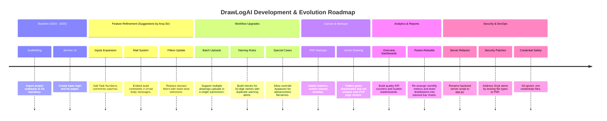

# Atlas Copco DrawLogAI: Phase 13 - Git & Version Control Analysis

This document provides a detailed audit of the version control structures, branching strategies, merge behaviors, and major developmental milestones of the **Atlas Copco DrawLogAI** project.

---

## 1. Git Repository Profile

### A. Active Branching Structure
The repository leverages a developer-specific isolation strategy to manage active development, staging, and stable releases:
* **`master`:** The primary production-stable branch. Deployed releases, hotfixes, and VM configurations reside here.
* **`dev`:** The integration branch where developer features are merged, resolved, and verified before staging deployments.
* **Feature Branches (`Sumit`, `tanmay`, `viraj`):** Local and remote sandboxes where individual developers write code, test scripts, and build modules in isolation.

### B. Merge Strategy
The history reveals a **Merge Commit & Pull Request (PR)** strategy:
* Developers commit directly to their sandboxes and submit PRs to merge into the common `dev` integration branch (e.g. *“Merge pull request #5 from Tanmaybora16/dev”*).
* Direct branch merges are performed on-demand for hotfixes (e.g., *“Merged with branch viraj”*).

### C. Release History
* Rather than formal Git tagging (e.g., semantic tags like `v1.0.0`), the system uses a **continuous integration release workflow**. The stable code commits are pushed directly into `master`, and compiled zip packages (`dist.zip`) are transferred to the production virtual machine server.

---

## 2. Project Evolution Milestones Timeline

The project’s commit history indicates a step-by-step evolution from a simple file uploader to an enterprise quality-assurance system:

---

## 3. Detailed Milestone Analysis

### Milestone 1: Initial Scaffolding & Sandbox Imports
* **Key Commits:** `e2ae21b`, `cb57e17` (*"Added the project to new repository"*).
* **Focus:** Establishing baseline folders structure (separating Python Flask files from Angular client modules), setting up dependencies lists, and linking database schemas.

### Milestone 2: Customer Quality Constraints & Iterations
* **Key Commits:** `53a52d8` (*"provide task no entry, comments reflect in email body, replace division with team filter"*), `fe923ca`, `ffaef00`, `1de81e7` (*"Revised Version According to suggestions by Anuj Sir"*).
* **Focus:** Aligning the platform with business requirements from QA directors. Added task codes tracking, enabled transaction email bodies to pull comments dynamically, and replaced general division divisions with team structures.

### Milestone 3: Batch Operations & Drawing Naming Enforcements
* **Key Commits:** `4ee340c` (*"Submission Updates related to multiple drawings"*), `b0dff2a` (*"popup for duplicate and wrong name"*), `fe1fb08` (*"Add Special Case Accept for alphanumerical PDFs"*).
* **Focus:** Scalability enhancements. Enabled designers to upload 50+ drawing files simultaneously. Built regex validation to check if files began with standard 10-digit IDs, throwing duplicate prompts or wrong-naming warnings with "Special Case" overrides.

### Milestone 4: Interactive Canvas Rendering
* **Key Commits:** `46fbb35`, `7830dce` (*"Added the green tick and red cross"*), `1de5813` (*"Marker in canvas"*).
* **Focus:** Enhancing interactive review functionality. Integrated PDF.js drawing boards. Reviewers could place text comments and stamps, draw freehand lines, and bake check/cross vector graphics directly onto drawing files.

### Milestone 5: Quality Dashboards & Pareto Visualizations Rebuilds
* **Key Commits:** `4212412` (*"Added the overview report and more"*), `984dc95` (*"updated monthly report chart to stacked bar chart"*), `309177a` (*"convert team contribution treemap to bar chart"*), `65e13bb`.
* **Focus:** Rebuilding raw lists into quality indicators dashboards (pass/fail totals, leaderboard rankings, and monthly trend graphs).

### Milestone 6: Backend Refactoring, Security Patches & DevOps
* **Key Commits:** `6697179` (*"rename server file to app.py, secure uploads, update Dockerfile"*), `c66dfa8` (*"Update SMTP configuration with .env support"*), `9309815` (*"Fix Snyk alert by restricting file uploads to PDFs"*), `932dc8c` (*"Ignore .env files to prevent credential exposure"*).
* **Focus:** Hardening backend APIs, separating configurations from code bases via `.env` files, fixing Snyk vulnerabilities, securing directory traversals, and locking git-credentials from repository commits.
